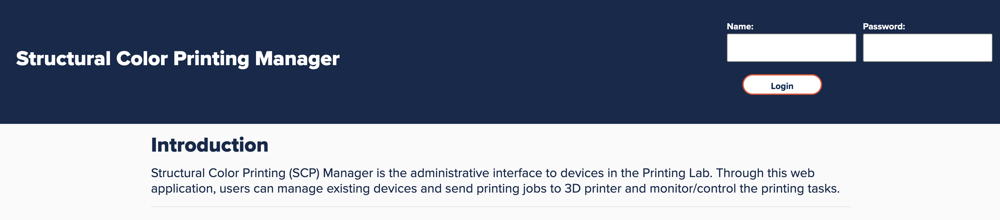
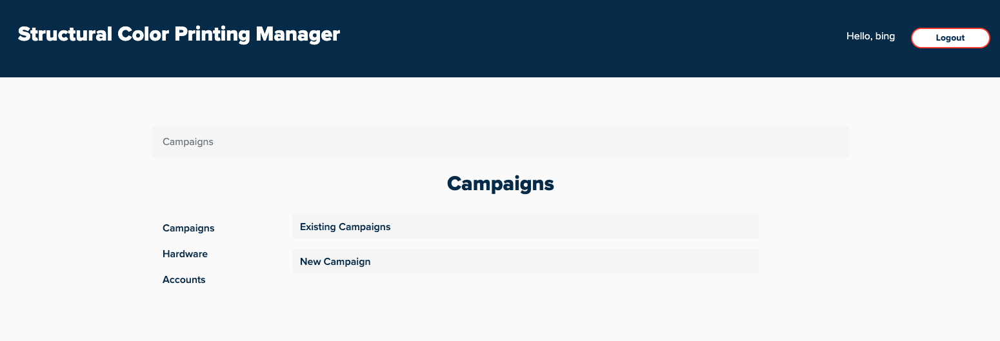
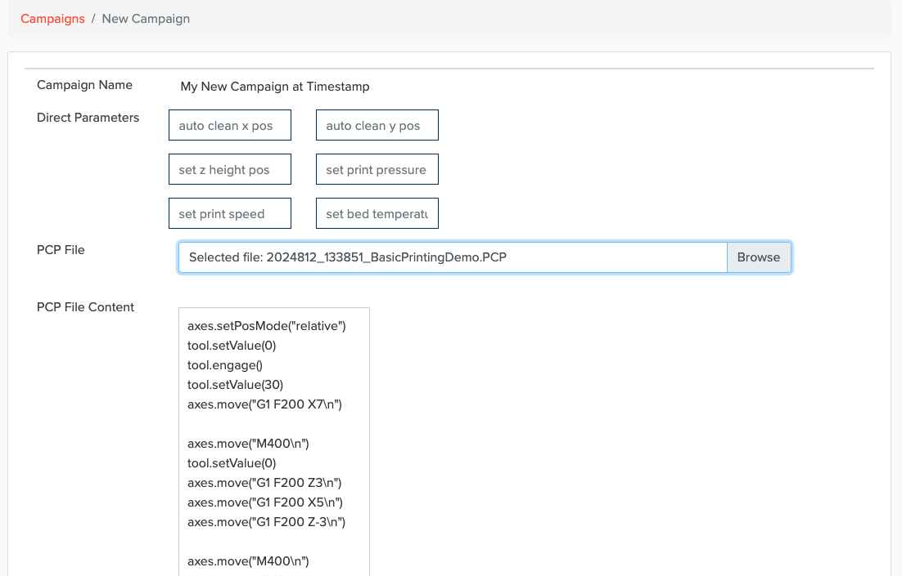
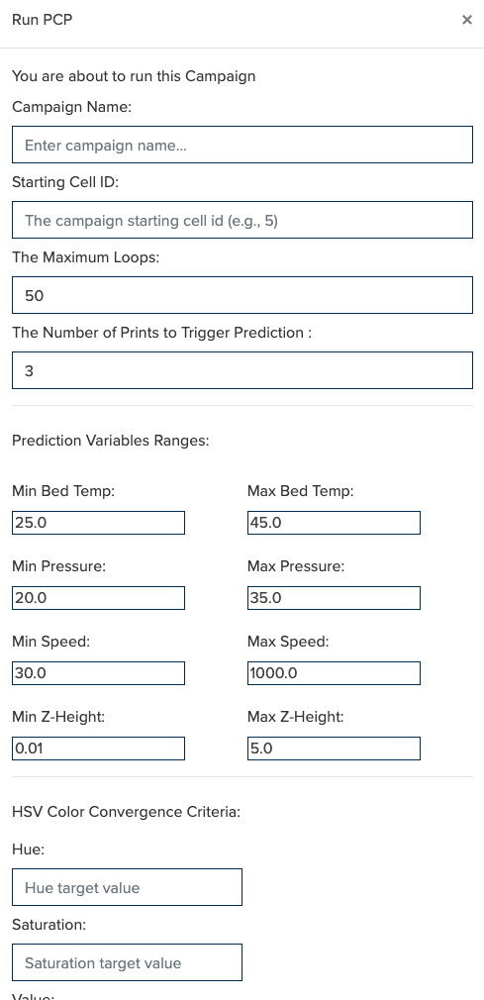
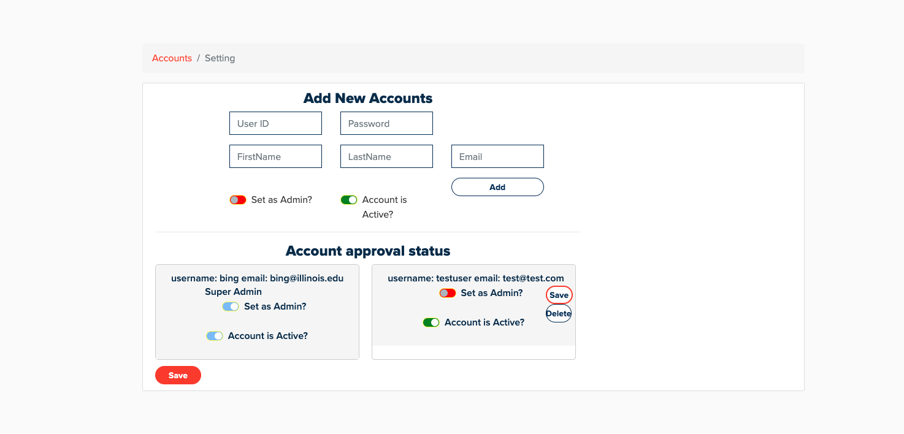

Campaign Manager User Guide
================================

++++++++++++++++++
User Login
++++++++++++++++++

When users visit the Campaign Manager web application, they can log in using their username and password.

++++++++++++++++++
Campaign
++++++++++++++++++

After logging in, the web application automatically redirects users to the Campaign page. On the left side, there are navigation tabs for Campaign, Hardware, and Accounts. On the right, since the user is currently on the Campaign page, the page title 'Campaign' is displayed at the top right. Below the title, there are two links: 'Existing Campaigns' and 'New Campaign.' Clicking 'Existing Campaigns' allows users to browse past campaigns, while selecting 'New Campaign' lets them start a new one.

++++++++++++++++++++++++++++++++++++++++++++++++++++++++++++++++++++++++++++++++++++++++++++++++++++++++++++++++++++++++++++++
Start a New Campaign
++++++++++++++++++++++++

On the New Campaign page, users can enter the initial (direct) parameters for the new campaign. These include the nozzle auto-clean absolute position (X and Y), the initial nozzle Z-axis height, the initial print pressure, print speed, and print bed temperature.

To begin a new campaign, users must load a PCP file by clicking the Browse button. Once selected, the contents of the PCP file will be displayed under the "PCP File Content" section on the page. Users can review the loaded file content directly within the interface. When ready, click the Run PCP button to start the new campaign.

##########
Run PCP
##########

When the user clicks the Run PCP button, a dialog will appear prompting the user to fill out a form with details about the new campaign. For example, the user can provide a name for the campaign.

The web application automatically divides the print bed into 2D cells based on the dimensions of the uploaded PCP file. The user can then specify the starting print position by entering the starting cell ID.

A campaign consists of multiple prints, with each print occupying one cell. The user can define the maximum number of prints for the campaign, as well as the number of prints required to trigger machine learning (ML) predictions.

The next section of the form allows the user to set value ranges for the prediction variables.

Additionally, users can configure the HSV Color Convergence Criteria, which allows them to define target HSV values to determine when the campaign should stop. The system receives HSV values from each print image, and once the specified target values are reached, the campaign will automatically stop.

++++++++++++++++++++++++
Account Management
++++++++++++++++++++++++

Only administrators have access to manage user accounts.

To create a new user account, the admin must provide the following information:

 - User ID

 - Password

 - First Name

 - Last Name

 - Email Address

The admin can also use toggle buttons to assign admin privileges to the new account and to set the account's status as active or disabled.

Administrators can manage existing user accounts as well. This includes updating admin permissions and modifying the active status of any user. Changes can be saved individually for each account, or the admin can click the Save button at the bottom of the page to save all changes at once.

Note: The Super Admin account is created using the admin.py script located in the scripts folder of the repository. This account typically has full system privileges and is intended for initial setup or advanced configuration.
