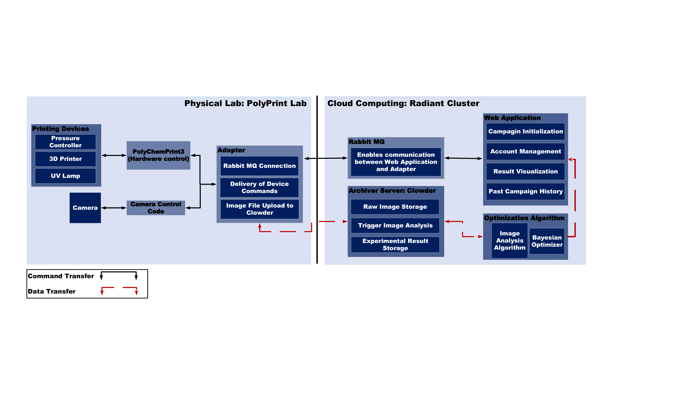

System Overview
================
The Structural Color Printing (SCP) system consists of three main components: a 3D print campaign manager, an adaptor for Marlin firmware-based 3D printers, and an intelligent image analysis module.

++++++++++++++++++
Campaign Manager
++++++++++++++++++
The campaign manager is a web-based service that provides an administrative interface for managing remote 3D printers. It includes user account management features, allowing administrators to create, enable, or disable user accounts. Through this web application, users can manage connected devices, submit printing jobs, and monitor or control printing tasks. Once logged in, users can browse historical campaign print results, initiate new campaigns with customized print parameters, and visualize print images in real-time.

+++++++++
Adaptor
+++++++++
The adaptor is a daemon process running on a machine physically near the 3D printer. It receives commands from the campaign manager and translates them into G-code instructions compatible with the Marlin firmware used by the 3D printer. The adaptor also sends updated campaign status information back to the campaign manager. Upon completion of a print job, the printer’s camera captures an image of the printed result and uploads it to Clowder for archival and further analysis.

++++++++++++++++++
Image Analysis
++++++++++++++++++
During an active campaign, the campaign manager forwards the captured print images along with current print parameters to the image analysis module. This module applies machine learning algorithms to evaluate the print quality and predict optimized parameters for future prints. These adjusted parameters are then returned to the campaign manager, which uses them to conduct the next print iteration.